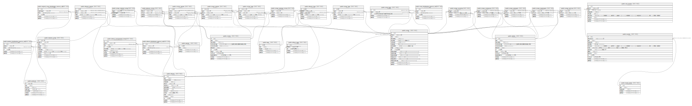

# touhou_arrangement_chronicle

## Tables

| Name | Columns | Comment | Type |
| ---- | ------- | ------- | ---- |
| [public.products](public.products.md) | 7 | 原作 | BASE TABLE |
| [public.original_songs](public.original_songs.md) | 10 | 原曲 | BASE TABLE |
| [public.product_distribution_service_urls](public.product_distribution_service_urls.md) | 6 | 原作(音楽)配信サービスURL | BASE TABLE |
| [public.original_song_distribution_service_urls](public.original_song_distribution_service_urls.md) | 6 | 原曲配信サービスURL | BASE TABLE |
| [public.event_series](public.event_series.md) | 5 | イベントシリーズ | BASE TABLE |
| [public.events](public.events.md) | 14 | イベント | BASE TABLE |
| [public.sub_events](public.sub_events.md) | 9 | サブイベント | BASE TABLE |
| [public.artists](public.artists.md) | 12 | アーティスト | BASE TABLE |
| [public.circles](public.circles.md) | 12 | サークル | BASE TABLE |
| [public.albums](public.albums.md) | 15 | アルバム | BASE TABLE |
| [public.albums_circles](public.albums_circles.md) | 4 | アルバムとサークルの中間テーブル | BASE TABLE |
| [public.album_consignment_shops](public.album_consignment_shops.md) | 9 | アルバム委託販売ショップ | BASE TABLE |
| [public.album_distribution_service_urls](public.album_distribution_service_urls.md) | 6 | アルバム配信サービスURL | BASE TABLE |
| [public.album_upcs](public.album_upcs.md) | 5 | アルバムUPC | BASE TABLE |
| [public.songs](public.songs.md) | 18 | 楽曲 | BASE TABLE |
| [public.song_distribution_service_urls](public.song_distribution_service_urls.md) | 6 | 楽曲配信サービスURL | BASE TABLE |
| [public.song_isrcs](public.song_isrcs.md) | 5 | 楽曲ISRC | BASE TABLE |
| [public.songs_arrange_circles](public.songs_arrange_circles.md) | 4 | 楽曲編曲サークル | BASE TABLE |
| [public.songs_composers](public.songs_composers.md) | 4 | 楽曲作曲者 | BASE TABLE |
| [public.songs_arrangers](public.songs_arrangers.md) | 4 | 楽曲編曲者 | BASE TABLE |
| [public.songs_rearrangers](public.songs_rearrangers.md) | 4 | 楽曲再編曲者 | BASE TABLE |
| [public.songs_lyricists](public.songs_lyricists.md) | 4 | 楽曲作詞者 | BASE TABLE |
| [public.songs_vocalists](public.songs_vocalists.md) | 4 | 楽曲ボーカリスト | BASE TABLE |
| [public.songs_original_songs](public.songs_original_songs.md) | 4 | 楽曲原曲 | BASE TABLE |
| [public.genres](public.genres.md) | 4 | ジャンル | BASE TABLE |
| [public.tags](public.tags.md) | 5 | タグ | BASE TABLE |
| [public.albums_genres](public.albums_genres.md) | 6 | アルバムジャンル | BASE TABLE |
| [public.albums_tags](public.albums_tags.md) | 6 | アルバムタグ | BASE TABLE |
| [public.songs_genres](public.songs_genres.md) | 6 | 楽曲ジャンル | BASE TABLE |
| [public.songs_tags](public.songs_tags.md) | 6 | 楽曲タグ | BASE TABLE |
| [public.circles_genres](public.circles_genres.md) | 6 | サークルタグ | BASE TABLE |
| [public.circles_tags](public.circles_tags.md) | 6 | サークルタグ | BASE TABLE |

## Stored procedures and functions

| Name | ReturnType | Arguments | Type |
| ---- | ------- | ------- | ---- |
| public._xid_machine_id | int4 |  | FUNCTION |
| public.xid_encode | xid | _id integer[] | FUNCTION |
| public.xid_decode | _int4 | _xid public.xid | FUNCTION |
| public.xid | xid | _at timestamp with time zone DEFAULT CURRENT_TIMESTAMP | FUNCTION |
| public.xid_time | timestamptz | _xid public.xid | FUNCTION |
| public.xid_machine | _int4 | _xid public.xid | FUNCTION |
| public.xid_pid | int4 | _xid public.xid | FUNCTION |
| public.xid_counter | int4 | _xid public.xid | FUNCTION |

## Relations

---

> Generated by [tbls](https://github.com/k1LoW/tbls)
