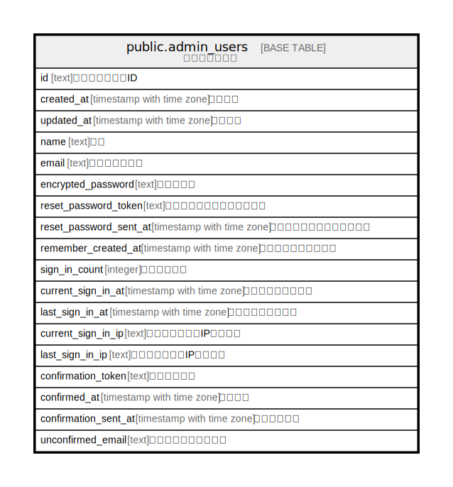

# public.admin_users

## Description

管理者ユーザー

## Columns

| Name | Type | Default | Nullable | Children | Parents | Comment |
| ---- | ---- | ------- | -------- | -------- | ------- | ------- |
| id | text | cuid() | false |  |  | 管理者ユーザーID |
| created_at | timestamp with time zone | CURRENT_TIMESTAMP | false |  |  | 作成日時 |
| updated_at | timestamp with time zone | CURRENT_TIMESTAMP | false |  |  | 更新日時 |
| name | text |  | true |  |  | 名前 |
| email | text | ''::text | false |  |  | メールアドレス |
| encrypted_password | text | ''::text | false |  |  | パスワード |
| reset_password_token | text |  | true |  |  | パスワードリセットトークン |
| reset_password_sent_at | timestamp with time zone |  | true |  |  | パスワードリセット送信日時 |
| remember_created_at | timestamp with time zone |  | true |  |  | ログイン情報記憶日時 |
| sign_in_count | integer | 0 | false |  |  | ログイン回数 |
| current_sign_in_at | timestamp with time zone |  | true |  |  | 現在のログイン日時 |
| last_sign_in_at | timestamp with time zone |  | true |  |  | 最後のログイン日時 |
| current_sign_in_ip | text |  | true |  |  | 現在のログインIPアドレス |
| last_sign_in_ip | text |  | true |  |  | 最後のログインIPアドレス |
| confirmation_token | text |  | true |  |  | 確認トークン |
| confirmed_at | timestamp with time zone |  | true |  |  | 確認日時 |
| confirmation_sent_at | timestamp with time zone |  | true |  |  | 確認送信日時 |
| unconfirmed_email | text |  | true |  |  | 未確認メールアドレス |

## Constraints

| Name | Type | Definition |
| ---- | ---- | ---------- |
| admin_users_pkey | PRIMARY KEY | PRIMARY KEY (id) |

## Indexes

| Name | Definition |
| ---- | ---------- |
| admin_users_pkey | CREATE UNIQUE INDEX admin_users_pkey ON public.admin_users USING btree (id) |
| index_admin_users_on_email | CREATE UNIQUE INDEX index_admin_users_on_email ON public.admin_users USING btree (email) |
| index_admin_users_on_reset_password_token | CREATE UNIQUE INDEX index_admin_users_on_reset_password_token ON public.admin_users USING btree (reset_password_token) |
| index_admin_users_on_confirmation_token | CREATE UNIQUE INDEX index_admin_users_on_confirmation_token ON public.admin_users USING btree (confirmation_token) |

## Relations

---

> Generated by [tbls](https://github.com/k1LoW/tbls)
