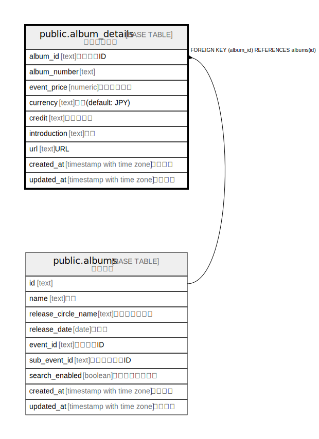

# public.album_details

## Description

アルバム詳細

## Columns

| Name | Type | Default | Nullable | Children | Parents | Comment |
| ---- | ---- | ------- | -------- | -------- | ------- | ------- |
| album_id | text |  | false |  | [public.albums](public.albums.md) | アルバムID |
| album_number | text | ''::text | false |  |  |  |
| event_price | numeric |  | true |  |  | イベント価格 |
| currency | text | 'JPY'::text | false |  |  | 通貨(default: JPY) |
| credit | text | ''::text | false |  |  | クレジット |
| introduction | text | ''::text | false |  |  | 紹介 |
| url | text | ''::text | false |  |  | URL |
| created_at | timestamp with time zone | CURRENT_TIMESTAMP | false |  |  | 作成日時 |
| updated_at | timestamp with time zone | CURRENT_TIMESTAMP | false |  |  | 更新日時 |

## Constraints

| Name | Type | Definition |
| ---- | ---- | ---------- |
| album_details_album_id_fkey | FOREIGN KEY | FOREIGN KEY (album_id) REFERENCES albums(id) |
| album_details_pkey | PRIMARY KEY | PRIMARY KEY (album_id) |

## Indexes

| Name | Definition |
| ---- | ---------- |
| album_details_pkey | CREATE UNIQUE INDEX album_details_pkey ON public.album_details USING btree (album_id) |

## Relations

---

> Generated by [tbls](https://github.com/k1LoW/tbls)
