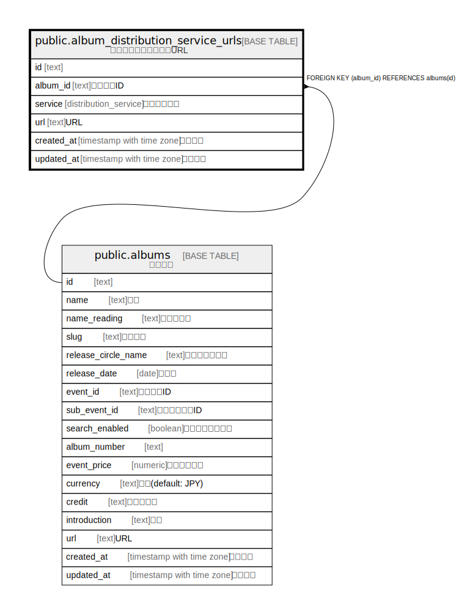

# public.album_distribution_service_urls

## Description

アルバム配信サービスURL

## Columns

| Name | Type | Default | Nullable | Children | Parents | Comment |
| ---- | ---- | ------- | -------- | -------- | ------- | ------- |
| id | text | cuid() | false |  |  |  |
| album_id | text |  | false |  | [public.albums](public.albums.md) | アルバムID |
| service | distribution_service |  | false |  |  | 配信サービス |
| url | text |  | false |  |  | URL |
| created_at | timestamp with time zone | CURRENT_TIMESTAMP | false |  |  | 作成日時 |
| updated_at | timestamp with time zone | CURRENT_TIMESTAMP | false |  |  | 更新日時 |

## Constraints

| Name | Type | Definition |
| ---- | ---- | ---------- |
| album_distribution_service_urls_album_id_fkey | FOREIGN KEY | FOREIGN KEY (album_id) REFERENCES albums(id) |
| album_distribution_service_urls_pkey | PRIMARY KEY | PRIMARY KEY (id) |

## Indexes

| Name | Definition |
| ---- | ---------- |
| album_distribution_service_urls_pkey | CREATE UNIQUE INDEX album_distribution_service_urls_pkey ON public.album_distribution_service_urls USING btree (id) |
| uk_adsu_album_id_service | CREATE UNIQUE INDEX uk_adsu_album_id_service ON public.album_distribution_service_urls USING btree (album_id, service) |

## Relations

---

> Generated by [tbls](https://github.com/k1LoW/tbls)
