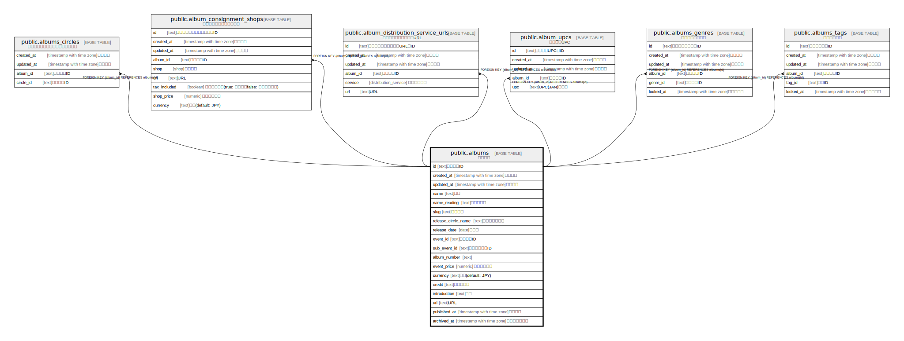

# public.albums

## Description

アルバム

## Columns

| Name | Type | Default | Nullable | Children | Parents | Comment |
| ---- | ---- | ------- | -------- | -------- | ------- | ------- |
| id | text | cuid() | false | [public.albums_circles](public.albums_circles.md) [public.album_consignment_shops](public.album_consignment_shops.md) [public.album_distribution_service_urls](public.album_distribution_service_urls.md) [public.album_upcs](public.album_upcs.md) [public.albums_genres](public.albums_genres.md) [public.albums_tags](public.albums_tags.md) |  | アルバムID |
| created_at | timestamp with time zone | CURRENT_TIMESTAMP | false |  |  | 作成日時 |
| updated_at | timestamp with time zone | CURRENT_TIMESTAMP | false |  |  | 更新日時 |
| name | text |  | false |  |  | 名前 |
| name_reading | text |  | true |  |  | 名前読み方 |
| slug | text | gen_random_uuid() | false |  |  | スラッグ |
| release_circle_name | text |  | true |  |  | 頒布サークル名 |
| release_date | date |  | true |  |  | 頒布日 |
| event_id | text |  | true |  |  | イベントID |
| sub_event_id | text |  | true |  |  | サブイベントID |
| album_number | text |  | true |  |  |  |
| event_price | numeric |  | true |  |  | イベント価格 |
| currency | text | 'JPY'::text | false |  |  | 通貨(default: JPY) |
| credit | text |  | true |  |  | クレジット |
| introduction | text |  | true |  |  | 紹介 |
| url | text |  | true |  |  | URL |
| published_at | timestamp with time zone |  | true |  |  | 公開日時 |
| archived_at | timestamp with time zone |  | true |  |  | アーカイブ日時 |

## Constraints

| Name | Type | Definition |
| ---- | ---- | ---------- |
| albums_pkey | PRIMARY KEY | PRIMARY KEY (id) |
| albums_slug_key | UNIQUE | UNIQUE (slug) |

## Indexes

| Name | Definition |
| ---- | ---------- |
| albums_pkey | CREATE UNIQUE INDEX albums_pkey ON public.albums USING btree (id) |
| albums_slug_key | CREATE UNIQUE INDEX albums_slug_key ON public.albums USING btree (slug) |

## Relations

---

> Generated by [tbls](https://github.com/k1LoW/tbls)
