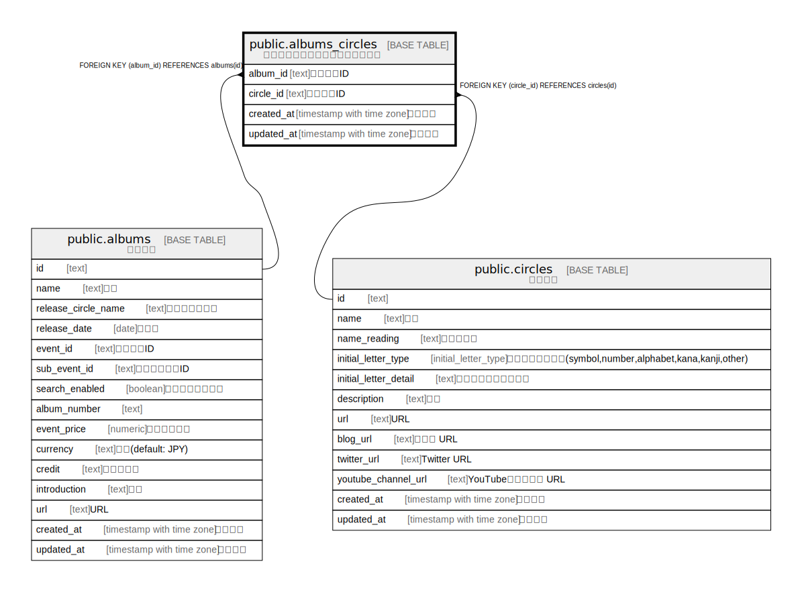

# public.albums_circles

## Description

アルバムとサークルの中間テーブル

## Columns

| Name | Type | Default | Nullable | Children | Parents | Comment |
| ---- | ---- | ------- | -------- | -------- | ------- | ------- |
| created_at | timestamp with time zone | CURRENT_TIMESTAMP | false |  |  | 作成日時 |
| updated_at | timestamp with time zone | CURRENT_TIMESTAMP | false |  |  | 更新日時 |
| album_id | text |  | false |  | [public.albums](public.albums.md) | アルバムID |
| circle_id | text |  | false |  | [public.circles](public.circles.md) | サークルID |

## Constraints

| Name | Type | Definition |
| ---- | ---- | ---------- |
| albums_circles_circle_id_fkey | FOREIGN KEY | FOREIGN KEY (circle_id) REFERENCES circles(id) |
| albums_circles_album_id_fkey | FOREIGN KEY | FOREIGN KEY (album_id) REFERENCES albums(id) |
| albums_circles_pkey | PRIMARY KEY | PRIMARY KEY (album_id, circle_id) |

## Indexes

| Name | Definition |
| ---- | ---------- |
| albums_circles_pkey | CREATE UNIQUE INDEX albums_circles_pkey ON public.albums_circles USING btree (album_id, circle_id) |

## Relations

---

> Generated by [tbls](https://github.com/k1LoW/tbls)
