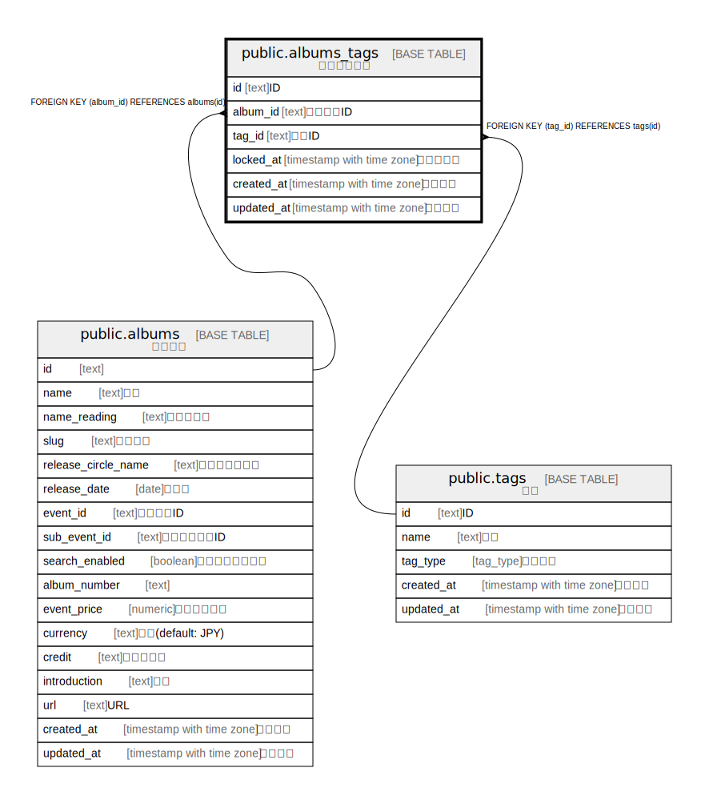

# public.albums_tags

## Description

アルバムタグ

## Columns

| Name | Type | Default | Nullable | Children | Parents | Comment |
| ---- | ---- | ------- | -------- | -------- | ------- | ------- |
| id | text | xid() | false |  |  | ID |
| album_id | text |  | false |  | [public.albums](public.albums.md) | アルバムID |
| tag_id | text |  | false |  | [public.tags](public.tags.md) | タグID |
| locked | boolean | false | false |  |  | ロック有無(true: ロック、false: アンロック) |
| created_at | timestamp with time zone | CURRENT_TIMESTAMP | false |  |  | 作成日時 |
| updated_at | timestamp with time zone | CURRENT_TIMESTAMP | false |  |  | 更新日時 |

## Constraints

| Name | Type | Definition |
| ---- | ---- | ---------- |
| albums_tags_album_id_fkey | FOREIGN KEY | FOREIGN KEY (album_id) REFERENCES albums(id) |
| albums_tags_tag_id_fkey | FOREIGN KEY | FOREIGN KEY (tag_id) REFERENCES tags(id) |
| albums_tags_pkey | PRIMARY KEY | PRIMARY KEY (id) |

## Indexes

| Name | Definition |
| ---- | ---------- |
| albums_tags_pkey | CREATE UNIQUE INDEX albums_tags_pkey ON public.albums_tags USING btree (id) |
| uk_albums_tags_song_id_tag_id | CREATE UNIQUE INDEX uk_albums_tags_song_id_tag_id ON public.albums_tags USING btree (album_id, tag_id) |

## Relations

---

> Generated by [tbls](https://github.com/k1LoW/tbls)
