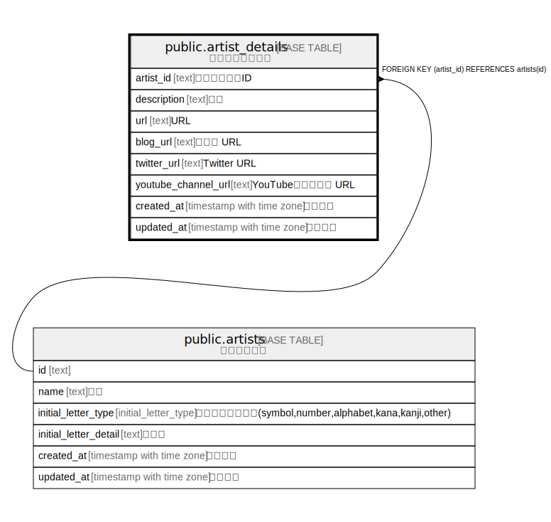

# public.artist_details

## Description

アーティスト詳細

## Columns

| Name | Type | Default | Nullable | Children | Parents | Comment |
| ---- | ---- | ------- | -------- | -------- | ------- | ------- |
| artist_id | text |  | false |  | [public.artists](public.artists.md) | アーティストID |
| description | text | ''::text | false |  |  | 説明 |
| url | text | ''::text | false |  |  | URL |
| blog_url | text | ''::text | false |  |  | ブログ URL |
| twitter_url | text | ''::text | false |  |  | Twitter URL |
| youtube_channel_url | text | ''::text | false |  |  | YouTubeチャンネル URL |
| created_at | timestamp with time zone | CURRENT_TIMESTAMP | false |  |  | 作成日時 |
| updated_at | timestamp with time zone | CURRENT_TIMESTAMP | false |  |  | 更新日時 |

## Constraints

| Name | Type | Definition |
| ---- | ---- | ---------- |
| artist_details_artist_id_fkey | FOREIGN KEY | FOREIGN KEY (artist_id) REFERENCES artists(id) |
| artist_details_pkey | PRIMARY KEY | PRIMARY KEY (artist_id) |

## Indexes

| Name | Definition |
| ---- | ---------- |
| artist_details_pkey | CREATE UNIQUE INDEX artist_details_pkey ON public.artist_details USING btree (artist_id) |

## Relations

---

> Generated by [tbls](https://github.com/k1LoW/tbls)
