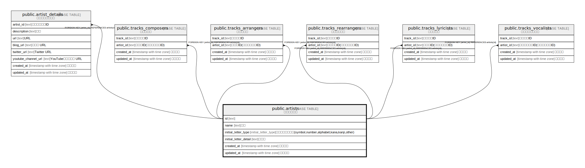

# public.artists

## Description

アーティスト

## Columns

| Name | Type | Default | Nullable | Children | Parents | Comment |
| ---- | ---- | ------- | -------- | -------- | ------- | ------- |
| id | text | xid() | false | [public.songs_composers](public.songs_composers.md) [public.songs_arrangers](public.songs_arrangers.md) [public.songs_rearrangers](public.songs_rearrangers.md) [public.songs_lyricists](public.songs_lyricists.md) [public.songs_vocalists](public.songs_vocalists.md) |  |  |
| name | text |  | false |  |  | 名前 |
| name_reading | text | ''::text | false |  |  | 名前読み方 |
| slug | text | gen_random_uuid() | false |  |  | スラッグ |
| initial_letter_type | initial_letter_type |  | false |  |  | 頭文字の文字種別(symbol,number,alphabet,kana,kanji,other) |
| initial_letter_detail | text | ''::text | false |  |  | 頭文字の文字種別詳細 |
| description | text | ''::text | false |  |  | 説明 |
| url | text | ''::text | false |  |  | URL |
| blog_url | text | ''::text | false |  |  | ブログ URL |
| twitter_url | text | ''::text | false |  |  | Twitter URL |
| youtube_channel_url | text | ''::text | false |  |  | YouTubeチャンネル URL |
| created_at | timestamp with time zone | CURRENT_TIMESTAMP | false |  |  | 作成日時 |
| updated_at | timestamp with time zone | CURRENT_TIMESTAMP | false |  |  | 更新日時 |

## Constraints

| Name | Type | Definition |
| ---- | ---- | ---------- |
| artists_pkey | PRIMARY KEY | PRIMARY KEY (id) |
| artists_slug_key | UNIQUE | UNIQUE (slug) |

## Indexes

| Name | Definition |
| ---- | ---------- |
| artists_pkey | CREATE UNIQUE INDEX artists_pkey ON public.artists USING btree (id) |
| artists_slug_key | CREATE UNIQUE INDEX artists_slug_key ON public.artists USING btree (slug) |

## Relations

---

> Generated by [tbls](https://github.com/k1LoW/tbls)
