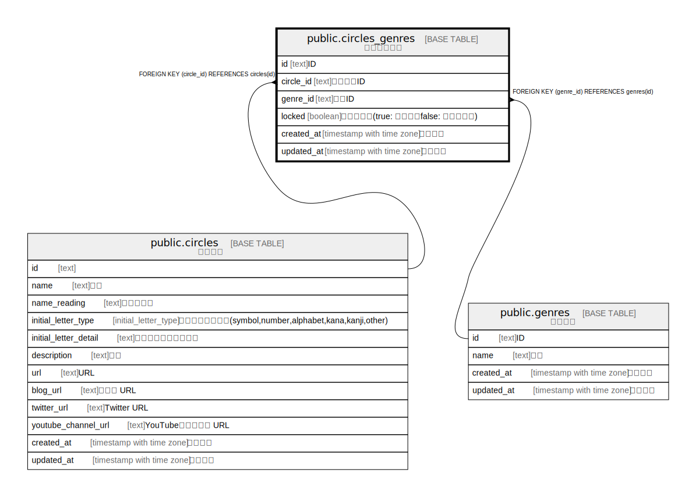

# public.circles_genres

## Description

サークルタグ

## Columns

| Name | Type | Default | Nullable | Children | Parents | Comment |
| ---- | ---- | ------- | -------- | -------- | ------- | ------- |
| id | text | cuid() | false |  |  | ID |
| circle_id | text |  | false |  | [public.circles](public.circles.md) | サークルID |
| genre_id | text |  | false |  | [public.genres](public.genres.md) | タグID |
| locked | boolean | false | false |  |  | ロック有無(true: ロック、false: アンロック) |
| created_at | timestamp with time zone | CURRENT_TIMESTAMP | false |  |  | 作成日時 |
| updated_at | timestamp with time zone | CURRENT_TIMESTAMP | false |  |  | 更新日時 |

## Constraints

| Name | Type | Definition |
| ---- | ---- | ---------- |
| circles_genres_circle_id_fkey | FOREIGN KEY | FOREIGN KEY (circle_id) REFERENCES circles(id) |
| circles_genres_genre_id_fkey | FOREIGN KEY | FOREIGN KEY (genre_id) REFERENCES genres(id) |
| circles_genres_pkey | PRIMARY KEY | PRIMARY KEY (id) |

## Indexes

| Name | Definition |
| ---- | ---------- |
| circles_genres_pkey | CREATE UNIQUE INDEX circles_genres_pkey ON public.circles_genres USING btree (id) |
| uk_circles_genres_circle_id_genre_id | CREATE UNIQUE INDEX uk_circles_genres_circle_id_genre_id ON public.circles_genres USING btree (circle_id, genre_id) |

## Relations

---

> Generated by [tbls](https://github.com/k1LoW/tbls)
