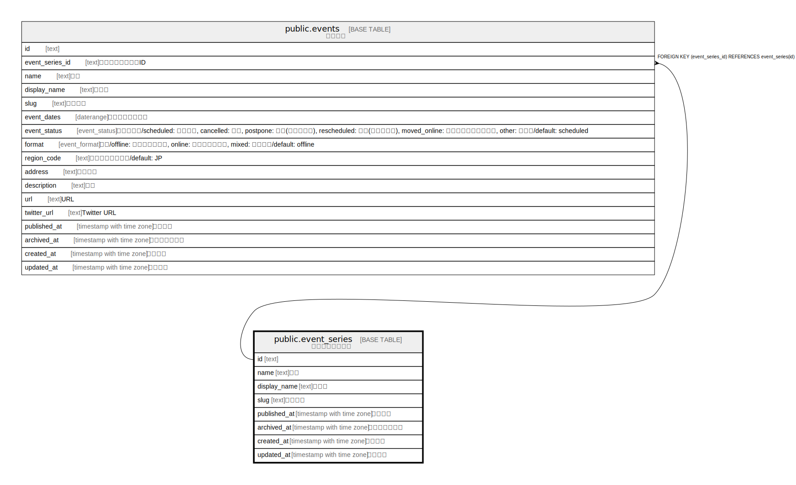

# public.event_series

## Description

イベントシリーズ

## Columns

| Name | Type | Default | Nullable | Children | Parents | Comment |
| ---- | ---- | ------- | -------- | -------- | ------- | ------- |
| id | text | cuid() | false | [public.events](public.events.md) |  |  |
| name | text |  | false |  |  | 名前 |
| display_name | text |  | false |  |  | 表示名 |
| slug | text | gen_random_uuid() | false |  |  | スラッグ |
| published_at | timestamp with time zone |  | true |  |  | 公開日時 |
| archived_at | timestamp with time zone |  | true |  |  | アーカイブ日時 |
| created_at | timestamp with time zone | CURRENT_TIMESTAMP | false |  |  | 作成日時 |
| updated_at | timestamp with time zone | CURRENT_TIMESTAMP | false |  |  | 更新日時 |

## Constraints

| Name | Type | Definition |
| ---- | ---- | ---------- |
| event_series_pkey | PRIMARY KEY | PRIMARY KEY (id) |
| event_series_name_key | UNIQUE | UNIQUE (name) |
| event_series_slug_key | UNIQUE | UNIQUE (slug) |

## Indexes

| Name | Definition |
| ---- | ---------- |
| event_series_pkey | CREATE UNIQUE INDEX event_series_pkey ON public.event_series USING btree (id) |
| event_series_name_key | CREATE UNIQUE INDEX event_series_name_key ON public.event_series USING btree (name) |
| event_series_slug_key | CREATE UNIQUE INDEX event_series_slug_key ON public.event_series USING btree (slug) |

## Relations

---

> Generated by [tbls](https://github.com/k1LoW/tbls)
