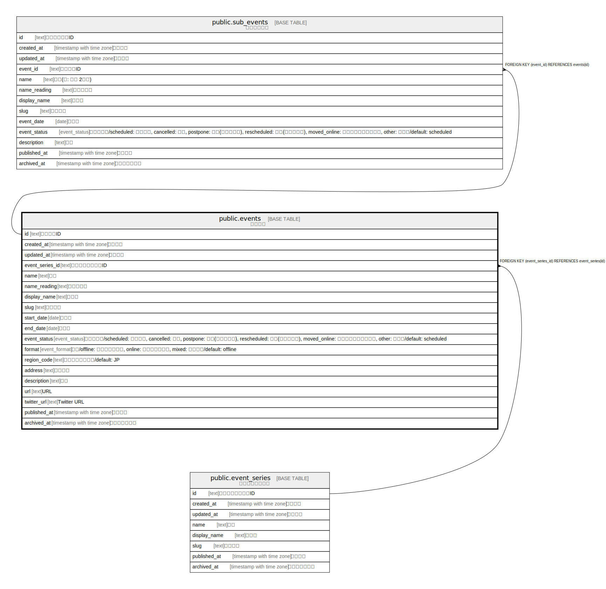

# public.events

## Description

イベント

## Columns

| Name | Type | Default | Nullable | Children | Parents | Comment |
| ---- | ---- | ------- | -------- | -------- | ------- | ------- |
| id | text |  | false | [public.event_details](public.event_details.md) [public.sub_events](public.sub_events.md) |  |  |
| event_series_id | text |  | false |  | [public.event_series](public.event_series.md) | イベントシリーズID |
| name | text |  | false |  |  | 名前 |
| created_at | timestamp with time zone | CURRENT_TIMESTAMP | false |  |  | 作成日時 |
| updated_at | timestamp with time zone | CURRENT_TIMESTAMP | false |  |  | 更新日時 |

## Constraints

| Name | Type | Definition |
| ---- | ---- | ---------- |
| events_event_series_id_fkey | FOREIGN KEY | FOREIGN KEY (event_series_id) REFERENCES event_series(id) |
| events_pkey | PRIMARY KEY | PRIMARY KEY (id) |
| events_name_key | UNIQUE | UNIQUE (name) |

## Indexes

| Name | Definition |
| ---- | ---------- |
| events_pkey | CREATE UNIQUE INDEX events_pkey ON public.events USING btree (id) |
| events_name_key | CREATE UNIQUE INDEX events_name_key ON public.events USING btree (name) |

## Relations

---

> Generated by [tbls](https://github.com/k1LoW/tbls)
