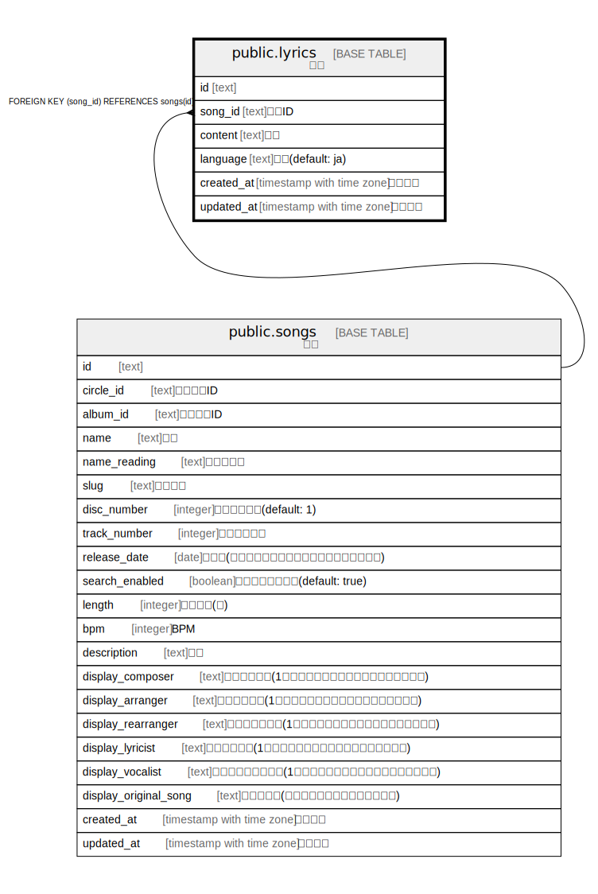

# public.lyrics

## Description

歌詞

## Columns

| Name | Type | Default | Nullable | Children | Parents | Comment |
| ---- | ---- | ------- | -------- | -------- | ------- | ------- |
| id | text | cuid() | false |  |  | 歌詞ID |
| created_at | timestamp with time zone | CURRENT_TIMESTAMP | false |  |  | 作成日時 |
| updated_at | timestamp with time zone | CURRENT_TIMESTAMP | false |  |  | 更新日時 |
| song_id | text |  | false |  | [public.songs](public.songs.md) | 楽曲ID |
| content | text |  | false |  |  | 歌詞 |
| language | text | 'ja'::text | true |  |  | 言語(default: ja) |

## Constraints

| Name | Type | Definition |
| ---- | ---- | ---------- |
| lyrics_song_id_fkey | FOREIGN KEY | FOREIGN KEY (song_id) REFERENCES songs(id) |
| lyrics_pkey | PRIMARY KEY | PRIMARY KEY (id) |

## Indexes

| Name | Definition |
| ---- | ---------- |
| lyrics_pkey | CREATE UNIQUE INDEX lyrics_pkey ON public.lyrics USING btree (id) |

## Relations

---

> Generated by [tbls](https://github.com/k1LoW/tbls)
