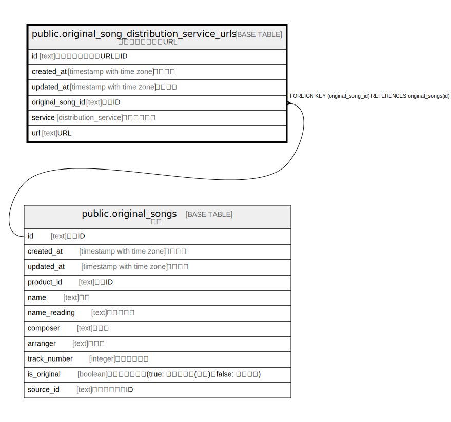

# public.original_song_distribution_service_urls

## Description

原曲配信サービスURL

## Columns

| Name | Type | Default | Nullable | Children | Parents | Comment |
| ---- | ---- | ------- | -------- | -------- | ------- | ------- |
| id | text | xid() | false |  |  |  |
| original_song_id | text |  | false |  | [public.original_songs](public.original_songs.md) | 原曲ID |
| service | distribution_service |  | false |  |  | 配信サービス |
| url | text |  | false |  |  | URL |
| created_at | timestamp with time zone | CURRENT_TIMESTAMP | false |  |  | 作成日時 |
| updated_at | timestamp with time zone | CURRENT_TIMESTAMP | false |  |  | 更新日時 |

## Constraints

| Name | Type | Definition |
| ---- | ---- | ---------- |
| original_song_distribution_service_urls_original_song_id_fkey | FOREIGN KEY | FOREIGN KEY (original_song_id) REFERENCES original_songs(id) |
| original_song_distribution_service_urls_pkey | PRIMARY KEY | PRIMARY KEY (id) |

## Indexes

| Name | Definition |
| ---- | ---------- |
| original_song_distribution_service_urls_pkey | CREATE UNIQUE INDEX original_song_distribution_service_urls_pkey ON public.original_song_distribution_service_urls USING btree (id) |
| uk_osdsu_original_song_id_service | CREATE UNIQUE INDEX uk_osdsu_original_song_id_service ON public.original_song_distribution_service_urls USING btree (original_song_id, service) |

## Relations

---

> Generated by [tbls](https://github.com/k1LoW/tbls)
