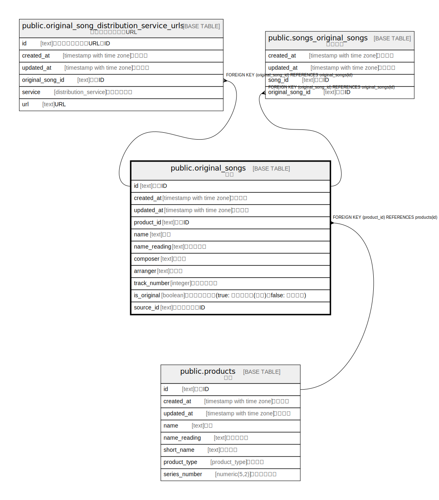

# public.original_songs

## Description

原曲

## Columns

| Name | Type | Default | Nullable | Children | Parents | Comment |
| ---- | ---- | ------- | -------- | -------- | ------- | ------- |
| id | text |  | false | [public.original_song_distribution_service_urls](public.original_song_distribution_service_urls.md) [public.songs_original_songs](public.songs_original_songs.md) |  | 原曲ID |
| product_id | text |  | false |  | [public.products](public.products.md) | 原作ID |
| name | text |  | false |  |  | 名前 |
| composer | text | ''::text | false |  |  | 作曲者 |
| arranger | text | ''::text | false |  |  | 編曲者 |
| track_number | integer |  | false |  |  | トラック番号 |
| is_original | boolean | false | false |  |  | オリジナル有無(true: オリジナル(初出)、false: 再録など) |
| source_id | text | ''::text | false |  |  | 原曲元の原曲ID |
| created_at | timestamp with time zone | CURRENT_TIMESTAMP | false |  |  | 作成日時 |
| updated_at | timestamp with time zone | CURRENT_TIMESTAMP | false |  |  | 更新日時 |

## Constraints

| Name | Type | Definition |
| ---- | ---- | ---------- |
| original_songs_product_id_fkey | FOREIGN KEY | FOREIGN KEY (product_id) REFERENCES products(id) |
| original_songs_pkey | PRIMARY KEY | PRIMARY KEY (id) |

## Indexes

| Name | Definition |
| ---- | ---------- |
| original_songs_pkey | CREATE UNIQUE INDEX original_songs_pkey ON public.original_songs USING btree (id) |

## Relations

---

> Generated by [tbls](https://github.com/k1LoW/tbls)
