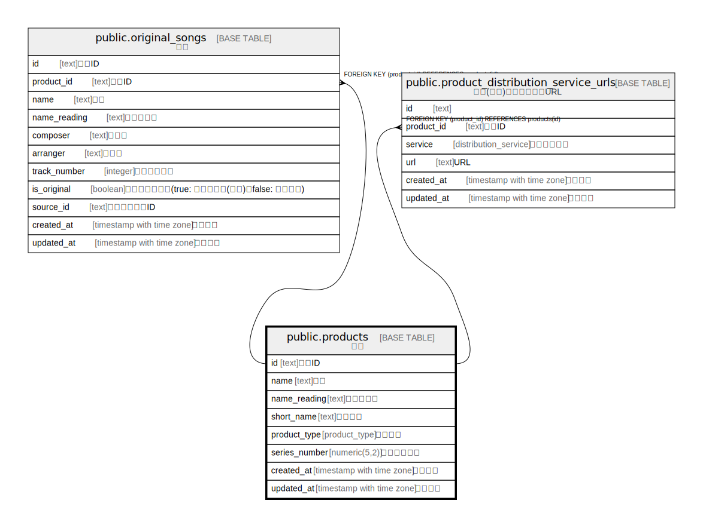

# public.products

## Description

原作

## Columns

| Name | Type | Default | Nullable | Children | Parents | Comment |
| ---- | ---- | ------- | -------- | -------- | ------- | ------- |
| id | text |  | false | [public.original_songs](public.original_songs.md) [public.product_distribution_service_urls](public.product_distribution_service_urls.md) |  | 原作ID |
| name | text |  | false |  |  | 名前 |
| name_reading | text |  | true |  |  | 名前読み方 |
| short_name | text |  | false |  |  | 短い名前 |
| product_type | product_type |  | false |  |  | 原作種別 |
| series_number | numeric(5,2) |  | false |  |  | シリーズ番号 |
| created_at | timestamp with time zone | CURRENT_TIMESTAMP | false |  |  | 作成日時 |
| updated_at | timestamp with time zone | CURRENT_TIMESTAMP | false |  |  | 更新日時 |

## Constraints

| Name | Type | Definition |
| ---- | ---- | ---------- |
| products_pkey | PRIMARY KEY | PRIMARY KEY (id) |

## Indexes

| Name | Definition |
| ---- | ---------- |
| products_pkey | CREATE UNIQUE INDEX products_pkey ON public.products USING btree (id) |

## Relations

---

> Generated by [tbls](https://github.com/k1LoW/tbls)
