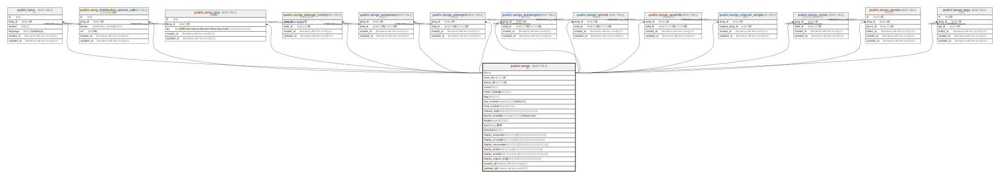

# public.songs

## Description

楽曲

## Columns

| Name | Type | Default | Nullable | Children | Parents | Comment |
| ---- | ---- | ------- | -------- | -------- | ------- | ------- |
| id | text | xid() | false | [public.song_distribution_service_urls](public.song_distribution_service_urls.md) [public.song_isrcs](public.song_isrcs.md) [public.songs_arrange_circles](public.songs_arrange_circles.md) [public.songs_composers](public.songs_composers.md) [public.songs_arrangers](public.songs_arrangers.md) [public.songs_rearrangers](public.songs_rearrangers.md) [public.songs_lyricists](public.songs_lyricists.md) [public.songs_vocalists](public.songs_vocalists.md) [public.songs_original_songs](public.songs_original_songs.md) [public.songs_circles](public.songs_circles.md) [public.songs_genres](public.songs_genres.md) [public.songs_tags](public.songs_tags.md) |  |  |
| circle_id | text | ''::text | false |  |  | サークルID |
| album_id | text | ''::text | false |  |  | アルバムID |
| name | text |  | false |  |  | 名前 |
| name_reading | text | ''::text | false |  |  | 名前読み方 |
| slug | text | gen_random_uuid() | false |  |  | スラッグ |
| disc_number | integer | 1 | false |  |  | ディスク番号(default: 1) |
| track_number | integer |  | false |  |  | トラック番号 |
| release_date | date |  | true |  |  | 頒布日(アルバムの頒布日と異なる場合に使用する) |
| search_enabled | boolean | true | false |  |  | 検索対象とするか(default: true) |
| length | integer |  | true |  |  | 曲の長さ(秒) |
| bpm | integer |  | true |  |  | BPM |
| description | text | ''::text | false |  |  | 説明 |
| display_composer | text | ''::text | false |  |  | 作曲者表示用(1度しか使用しない別名義などで使用する) |
| display_arranger | text | ''::text | false |  |  | 編曲者表示用(1度しか使用しない別名義などで使用する) |
| display_rearranger | text | ''::text | false |  |  | 再編曲者表示用(1度しか使用しない別名義などで使用する) |
| display_lyricist | text | ''::text | false |  |  | 作詞者表示用(1度しか使用しない別名義などで使用する) |
| display_vocalist | text | ''::text | false |  |  | ボーカリスト表示用(1度しか使用しない別名義などで使用する) |
| display_original_song | text | ''::text | false |  |  | 原曲表示用(東方以外の原曲などで使用する) |
| created_at | timestamp with time zone | CURRENT_TIMESTAMP | false |  |  | 作成日時 |
| updated_at | timestamp with time zone | CURRENT_TIMESTAMP | false |  |  | 更新日時 |

## Constraints

| Name | Type | Definition |
| ---- | ---- | ---------- |
| songs_pkey | PRIMARY KEY | PRIMARY KEY (id) |
| songs_slug_key | UNIQUE | UNIQUE (slug) |

## Indexes

| Name | Definition |
| ---- | ---------- |
| songs_pkey | CREATE UNIQUE INDEX songs_pkey ON public.songs USING btree (id) |
| songs_slug_key | CREATE UNIQUE INDEX songs_slug_key ON public.songs USING btree (slug) |

## Relations

---

> Generated by [tbls](https://github.com/k1LoW/tbls)
