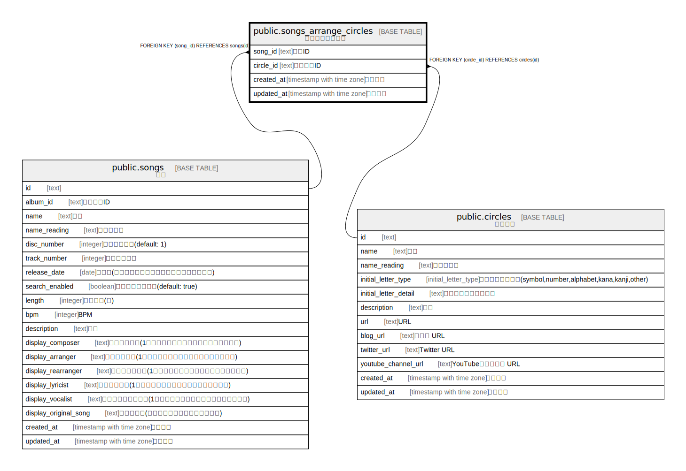

# public.songs_arrange_circles

## Description

楽曲編曲サークル

## Columns

| Name | Type | Default | Nullable | Children | Parents | Comment |
| ---- | ---- | ------- | -------- | -------- | ------- | ------- |
| created_at | timestamp with time zone | CURRENT_TIMESTAMP | false |  |  | 作成日時 |
| updated_at | timestamp with time zone | CURRENT_TIMESTAMP | false |  |  | 更新日時 |
| song_id | text |  | false |  | [public.songs](public.songs.md) | 楽曲ID |
| circle_id | text |  | false |  | [public.circles](public.circles.md) | サークルID |

## Constraints

| Name | Type | Definition |
| ---- | ---- | ---------- |
| songs_arrange_circles_circle_id_fkey | FOREIGN KEY | FOREIGN KEY (circle_id) REFERENCES circles(id) |
| songs_arrange_circles_song_id_fkey | FOREIGN KEY | FOREIGN KEY (song_id) REFERENCES songs(id) |
| songs_arrange_circles_pkey | PRIMARY KEY | PRIMARY KEY (song_id, circle_id) |

## Indexes

| Name | Definition |
| ---- | ---------- |
| songs_arrange_circles_pkey | CREATE UNIQUE INDEX songs_arrange_circles_pkey ON public.songs_arrange_circles USING btree (song_id, circle_id) |

## Relations

---

> Generated by [tbls](https://github.com/k1LoW/tbls)
