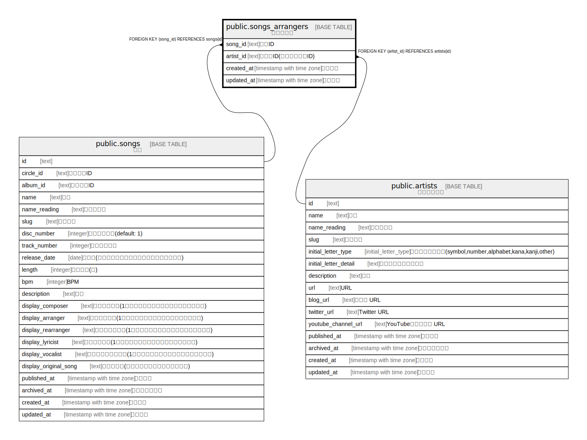

# public.songs_arrangers

## Description

楽曲編曲者

## Columns

| Name | Type | Default | Nullable | Children | Parents | Comment |
| ---- | ---- | ------- | -------- | -------- | ------- | ------- |
| song_id | text |  | false |  | [public.songs](public.songs.md) | 楽曲ID |
| artist_id | text |  | false |  | [public.artists](public.artists.md) | 編曲者ID(アーティストID) |
| created_at | timestamp with time zone | CURRENT_TIMESTAMP | false |  |  | 作成日時 |
| updated_at | timestamp with time zone | CURRENT_TIMESTAMP | false |  |  | 更新日時 |

## Constraints

| Name | Type | Definition |
| ---- | ---- | ---------- |
| songs_arrangers_artist_id_fkey | FOREIGN KEY | FOREIGN KEY (artist_id) REFERENCES artists(id) |
| songs_arrangers_song_id_fkey | FOREIGN KEY | FOREIGN KEY (song_id) REFERENCES songs(id) |
| songs_arrangers_pkey | PRIMARY KEY | PRIMARY KEY (song_id, artist_id) |

## Indexes

| Name | Definition |
| ---- | ---------- |
| songs_arrangers_pkey | CREATE UNIQUE INDEX songs_arrangers_pkey ON public.songs_arrangers USING btree (song_id, artist_id) |

## Relations

---

> Generated by [tbls](https://github.com/k1LoW/tbls)
