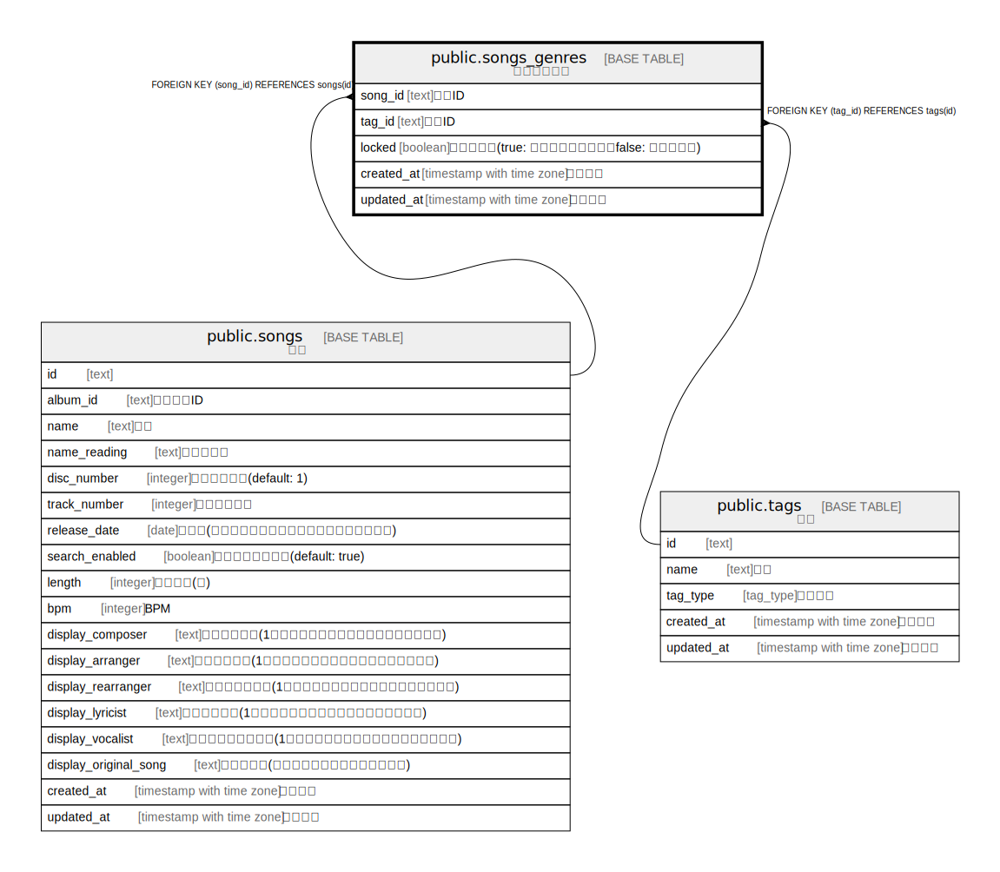

# public.songs_genres

## Description

楽曲ジャンル

## Columns

| Name | Type | Default | Nullable | Children | Parents | Comment |
| ---- | ---- | ------- | -------- | -------- | ------- | ------- |
| id | text | cuid() | false |  |  | 楽曲ジャンルID |
| created_at | timestamp with time zone | CURRENT_TIMESTAMP | false |  |  | 作成日時 |
| updated_at | timestamp with time zone | CURRENT_TIMESTAMP | false |  |  | 更新日時 |
| song_id | text |  | false |  | [public.songs](public.songs.md) | 楽曲ID |
| genre_id | text |  | false |  | [public.genres](public.genres.md) | ジャンルID |
| locked_at | timestamp with time zone |  | true |  |  | ロック日時 |

## Constraints

| Name | Type | Definition |
| ---- | ---- | ---------- |
| songs_genres_song_id_fkey | FOREIGN KEY | FOREIGN KEY (song_id) REFERENCES songs(id) |
| songs_genres_genre_id_fkey | FOREIGN KEY | FOREIGN KEY (genre_id) REFERENCES genres(id) |
| songs_genres_pkey | PRIMARY KEY | PRIMARY KEY (id) |

## Indexes

| Name | Definition |
| ---- | ---------- |
| songs_genres_pkey | CREATE UNIQUE INDEX songs_genres_pkey ON public.songs_genres USING btree (id) |
| uk_songs_genres_song_id_genre_id | CREATE UNIQUE INDEX uk_songs_genres_song_id_genre_id ON public.songs_genres USING btree (song_id, genre_id) |

## Relations

---

> Generated by [tbls](https://github.com/k1LoW/tbls)
