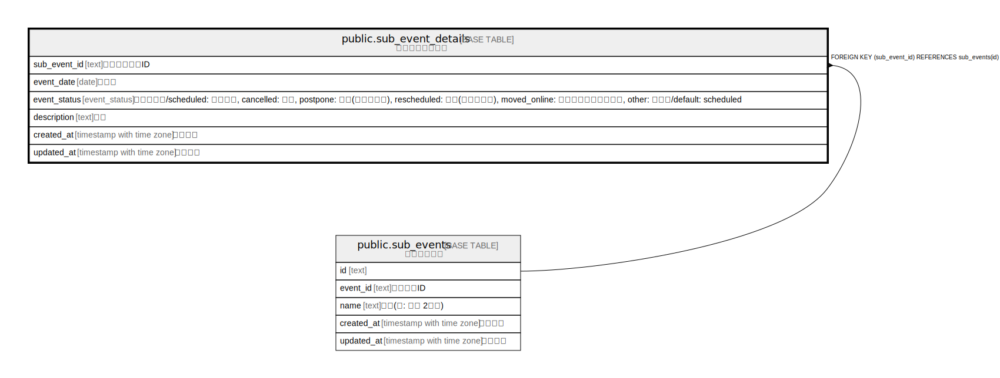

# public.sub_event_details

## Description

サブイベント詳細

## Columns

| Name | Type | Default | Nullable | Children | Parents | Comment |
| ---- | ---- | ------- | -------- | -------- | ------- | ------- |
| sub_event_id | text |  | false |  | [public.sub_events](public.sub_events.md) | サブイベントID |
| event_date | date |  | true |  |  | 開催日 |
| event_status | event_status | 'scheduled'::event_status | false |  |  | ステータス/scheduled: 開催済み, cancelled: 中止, postpone: 延期(開催日未定), rescheduled: 延期(開催日決定), moved_online: オンライン開催に変更, other: その他/default: scheduled |
| description | text | ''::text | false |  |  | 説明 |
| created_at | timestamp with time zone | CURRENT_TIMESTAMP | false |  |  | 作成日時 |
| updated_at | timestamp with time zone | CURRENT_TIMESTAMP | false |  |  | 更新日時 |

## Constraints

| Name | Type | Definition |
| ---- | ---- | ---------- |
| sub_event_details_sub_event_id_fkey | FOREIGN KEY | FOREIGN KEY (sub_event_id) REFERENCES sub_events(id) |
| sub_event_details_pkey | PRIMARY KEY | PRIMARY KEY (sub_event_id) |

## Indexes

| Name | Definition |
| ---- | ---------- |
| sub_event_details_pkey | CREATE UNIQUE INDEX sub_event_details_pkey ON public.sub_event_details USING btree (sub_event_id) |

## Relations

---

> Generated by [tbls](https://github.com/k1LoW/tbls)
