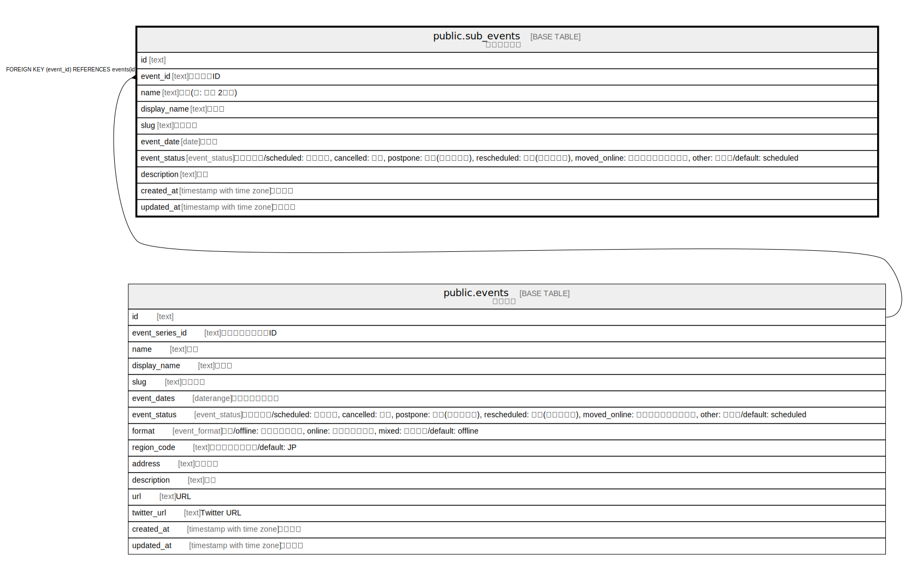

# public.sub_events

## Description

サブイベント

## Columns

| Name | Type | Default | Nullable | Children | Parents | Comment |
| ---- | ---- | ------- | -------- | -------- | ------- | ------- |
| id | text | xid() | false |  |  |  |
| event_id | text |  | false |  | [public.events](public.events.md) | イベントID |
| name | text |  | false |  |  | 名前(例: 〇〇 2日目) |
| display_name | text |  | false |  |  | 表示名 |
| slug | text | gen_random_uuid() | false |  |  | スラッグ |
| event_date | date |  | true |  |  | 開催日 |
| event_status | event_status | 'scheduled'::event_status | false |  |  | ステータス/scheduled: 開催済み, cancelled: 中止, postpone: 延期(開催日未定), rescheduled: 延期(開催日決定), moved_online: オンライン開催に変更, other: その他/default: scheduled |
| description | text | ''::text | false |  |  | 説明 |
| created_at | timestamp with time zone | CURRENT_TIMESTAMP | false |  |  | 作成日時 |
| updated_at | timestamp with time zone | CURRENT_TIMESTAMP | false |  |  | 更新日時 |

## Constraints

| Name | Type | Definition |
| ---- | ---- | ---------- |
| sub_events_event_id_fkey | FOREIGN KEY | FOREIGN KEY (event_id) REFERENCES events(id) |
| sub_events_pkey | PRIMARY KEY | PRIMARY KEY (id) |
| sub_events_name_key | UNIQUE | UNIQUE (name) |
| sub_events_slug_key | UNIQUE | UNIQUE (slug) |

## Indexes

| Name | Definition |
| ---- | ---------- |
| sub_events_pkey | CREATE UNIQUE INDEX sub_events_pkey ON public.sub_events USING btree (id) |
| sub_events_name_key | CREATE UNIQUE INDEX sub_events_name_key ON public.sub_events USING btree (name) |
| sub_events_slug_key | CREATE UNIQUE INDEX sub_events_slug_key ON public.sub_events USING btree (slug) |

## Relations

---

> Generated by [tbls](https://github.com/k1LoW/tbls)
