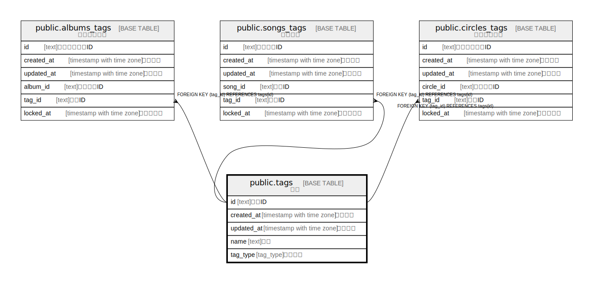

# public.tags

## Description

タグ

## Columns

| Name | Type | Default | Nullable | Children | Parents | Comment |
| ---- | ---- | ------- | -------- | -------- | ------- | ------- |
| id | text |  | false | [public.albums_genres](public.albums_genres.md) [public.albums_tags](public.albums_tags.md) [public.tracks_genres](public.tracks_genres.md) [public.tracks_tags](public.tracks_tags.md) [public.circles_tags](public.circles_tags.md) |  |  |
| name | text |  | false |  |  | 名前 |
| tag_type | tag_type | 'unknown'::tag_type | false |  |  | タグ種別 |
| created_at | timestamp with time zone | CURRENT_TIMESTAMP | false |  |  | 作成日時 |
| updated_at | timestamp with time zone | CURRENT_TIMESTAMP | false |  |  | 更新日時 |

## Constraints

| Name | Type | Definition |
| ---- | ---- | ---------- |
| tags_pkey | PRIMARY KEY | PRIMARY KEY (id) |

## Indexes

| Name | Definition |
| ---- | ---------- |
| tags_pkey | CREATE UNIQUE INDEX tags_pkey ON public.tags USING btree (id) |

## Relations

---

> Generated by [tbls](https://github.com/k1LoW/tbls)
