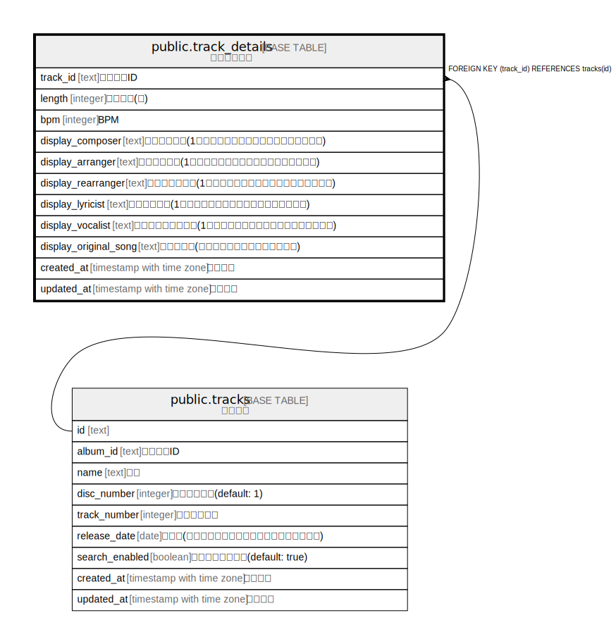

# public.track_details

## Description

トラック詳細

## Columns

| Name | Type | Default | Nullable | Children | Parents | Comment |
| ---- | ---- | ------- | -------- | -------- | ------- | ------- |
| track_id | text |  | false |  | [public.tracks](public.tracks.md) | トラックID |
| length | integer |  | true |  |  | 曲の長さ(秒) |
| bpm | integer |  | true |  |  | BPM |
| display_composer | text | ''::text | false |  |  | 作曲者表示用(1度しか使用しない別名義などで使用する) |
| display_arranger | text | ''::text | false |  |  | 編曲者表示用(1度しか使用しない別名義などで使用する) |
| display_rearranger | text | ''::text | false |  |  | 再編曲者表示用(1度しか使用しない別名義などで使用する) |
| display_lyricist | text | ''::text | false |  |  | 作詞者表示用(1度しか使用しない別名義などで使用する) |
| display_vocalist | text | ''::text | false |  |  | ボーカリスト表示用(1度しか使用しない別名義などで使用する) |
| display_original_song | text | ''::text | false |  |  | 原曲表示用(東方以外の原曲などで使用する) |
| created_at | timestamp with time zone | CURRENT_TIMESTAMP | false |  |  | 作成日時 |
| updated_at | timestamp with time zone | CURRENT_TIMESTAMP | false |  |  | 更新日時 |

## Constraints

| Name | Type | Definition |
| ---- | ---- | ---------- |
| track_details_track_id_fkey | FOREIGN KEY | FOREIGN KEY (track_id) REFERENCES tracks(id) |
| track_details_pkey | PRIMARY KEY | PRIMARY KEY (track_id) |

## Indexes

| Name | Definition |
| ---- | ---------- |
| track_details_pkey | CREATE UNIQUE INDEX track_details_pkey ON public.track_details USING btree (track_id) |

## Relations

---

> Generated by [tbls](https://github.com/k1LoW/tbls)
