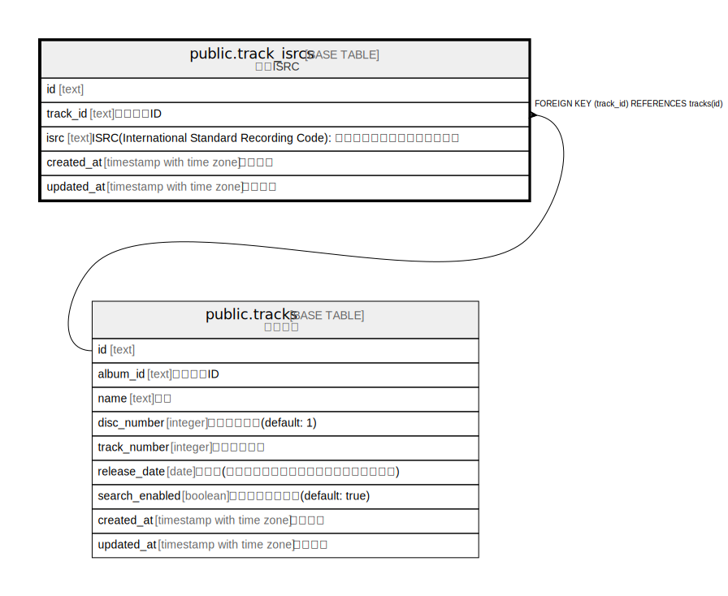

# public.track_isrcs

## Description

楽曲ISRC

## Columns

| Name | Type | Default | Nullable | Children | Parents | Comment |
| ---- | ---- | ------- | -------- | -------- | ------- | ------- |
| id | text |  | false |  |  |  |
| track_id | text |  | false |  | [public.tracks](public.tracks.md) | トラックID |
| isrc | text |  | false |  |  | ISRC(International Standard Recording Code): 国際標準レコーディングコード |
| created_at | timestamp with time zone | CURRENT_TIMESTAMP | false |  |  | 作成日時 |
| updated_at | timestamp with time zone | CURRENT_TIMESTAMP | false |  |  | 更新日時 |

## Constraints

| Name | Type | Definition |
| ---- | ---- | ---------- |
| track_isrcs_track_id_fkey | FOREIGN KEY | FOREIGN KEY (track_id) REFERENCES tracks(id) |
| track_isrcs_pkey | PRIMARY KEY | PRIMARY KEY (id) |

## Indexes

| Name | Definition |
| ---- | ---------- |
| track_isrcs_pkey | CREATE UNIQUE INDEX track_isrcs_pkey ON public.track_isrcs USING btree (id) |
| uk_track_isrcs_track_id_isrc | CREATE UNIQUE INDEX uk_track_isrcs_track_id_isrc ON public.track_isrcs USING btree (track_id, isrc) |

## Relations

---

> Generated by [tbls](https://github.com/k1LoW/tbls)
