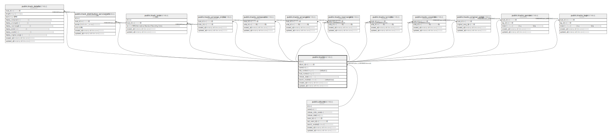

# public.tracks

## Description

トラック

## Columns

| Name | Type | Default | Nullable | Children | Parents | Comment |
| ---- | ---- | ------- | -------- | -------- | ------- | ------- |
| id | text |  | false | [public.track_details](public.track_details.md) [public.track_distribution_service_urls](public.track_distribution_service_urls.md) [public.track_isrcs](public.track_isrcs.md) [public.tracks_arrange_circles](public.tracks_arrange_circles.md) [public.tracks_composers](public.tracks_composers.md) [public.tracks_arrangers](public.tracks_arrangers.md) [public.tracks_rearrangers](public.tracks_rearrangers.md) [public.tracks_lyricists](public.tracks_lyricists.md) [public.tracks_vocalists](public.tracks_vocalists.md) [public.tracks_original_songs](public.tracks_original_songs.md) [public.tracks_genres](public.tracks_genres.md) [public.tracks_tags](public.tracks_tags.md) |  |  |
| album_id | text |  | false |  | [public.albums](public.albums.md) | アルバムID |
| name | text |  | false |  |  | 名前 |
| disc_number | integer | 1 | false |  |  | ディスク番号(default: 1) |
| track_number | integer |  | false |  |  | トラック番号 |
| release_date | date |  | true |  |  | 頒布日(アルバムの頒布日と異なる場合に使用する) |
| search_enabled | boolean | true | false |  |  | 検索対象とするか(default: true) |
| created_at | timestamp with time zone | CURRENT_TIMESTAMP | false |  |  | 作成日時 |
| updated_at | timestamp with time zone | CURRENT_TIMESTAMP | false |  |  | 更新日時 |

## Constraints

| Name | Type | Definition |
| ---- | ---- | ---------- |
| tracks_album_id_fkey | FOREIGN KEY | FOREIGN KEY (album_id) REFERENCES albums(id) |
| tracks_pkey | PRIMARY KEY | PRIMARY KEY (id) |

## Indexes

| Name | Definition |
| ---- | ---------- |
| tracks_pkey | CREATE UNIQUE INDEX tracks_pkey ON public.tracks USING btree (id) |

## Relations

---

> Generated by [tbls](https://github.com/k1LoW/tbls)
