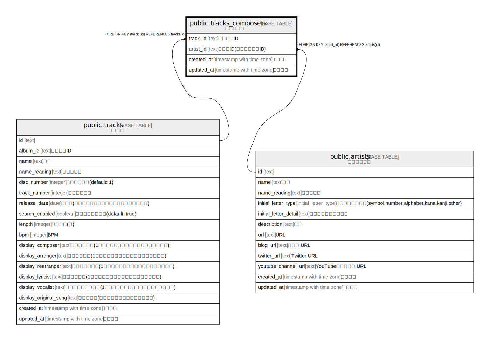

# public.tracks_composers

## Description

楽曲作曲者

## Columns

| Name | Type | Default | Nullable | Children | Parents | Comment |
| ---- | ---- | ------- | -------- | -------- | ------- | ------- |
| track_id | text |  | false |  | [public.tracks](public.tracks.md) | トラックID |
| artist_id | text |  | false |  | [public.artists](public.artists.md) | 作曲者ID(アーティストID) |
| created_at | timestamp with time zone | CURRENT_TIMESTAMP | false |  |  | 作成日時 |
| updated_at | timestamp with time zone | CURRENT_TIMESTAMP | false |  |  | 更新日時 |

## Constraints

| Name | Type | Definition |
| ---- | ---- | ---------- |
| tracks_composers_artist_id_fkey | FOREIGN KEY | FOREIGN KEY (artist_id) REFERENCES artists(id) |
| tracks_composers_track_id_fkey | FOREIGN KEY | FOREIGN KEY (track_id) REFERENCES tracks(id) |
| tracks_composers_pkey | PRIMARY KEY | PRIMARY KEY (track_id, artist_id) |

## Indexes

| Name | Definition |
| ---- | ---------- |
| tracks_composers_pkey | CREATE UNIQUE INDEX tracks_composers_pkey ON public.tracks_composers USING btree (track_id, artist_id) |

## Relations

---

> Generated by [tbls](https://github.com/k1LoW/tbls)
